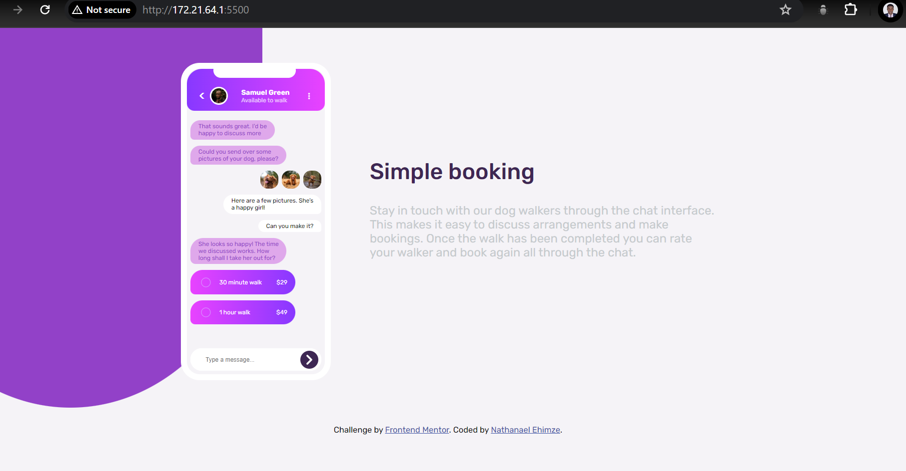

# Frontend Mentor - Chat app CSS illustration solution

This is a solution to the [Chat app CSS illustration challenge on Frontend Mentor](https://www.frontendmentor.io/challenges/chat-app-css-illustration-O5auMkFqY). Frontend Mentor challenges help you improve your coding skills by building realistic projects.

## Table of contents

- [Overview](#overview)
  - [The challenge](#the-challenge)
  - [Screenshot](#screenshot)
  - [Links](#links)
  - [Built with](#built-with)
  - [What I learned](#what-i-learned)
  - [Continued development](#continued-development)
- [Author](#author)
- [Acknowledgments](#acknowledgments)

## Overview

### The challenge

Users should be able to:

- View the optimal layout for the component depending on their device's screen size

### Screenshot

### Links

- Solution URL: [Github solution link](https://github.com/ehimze007/chat-app-css-illustration)
- Live Site URL: [Hosted page](https://ehimze007.github.io/chat-app-css-illustration/)

### Built with

- Semantic HTML5 markup
- CSS custom properties
- Flexbox
- Positioning
- Mobile-first workflow

### What I learned

I gained a strong understanding of using positioning, never understood how much importnace it has until I had to design the mobile chat interface.

<!-- If you want more help with writing markdown, we'd recommend checking out [The Markdown Guide](https://www.markdownguide.org/) to learn more. -->

### Continued development

I will continue working on tasks that will earn my good mastery of flexbox and grids.

**Note: Delete this note and the content within this section and replace with your own plans for continued development.**

## Author

- Frontend Mentor - [@ehimze007](https://www.frontendmentor.io/profile/ehimze007)
- Twitter - [@ehimze007](https://www.twitter.com/ehimze007)

## Acknowledgments

Special thanks to [@IG-MATRIX](https://github.com/Ig-Matrix)! Keeps on cheering me and providing helpful pointers when I feel stuck.
